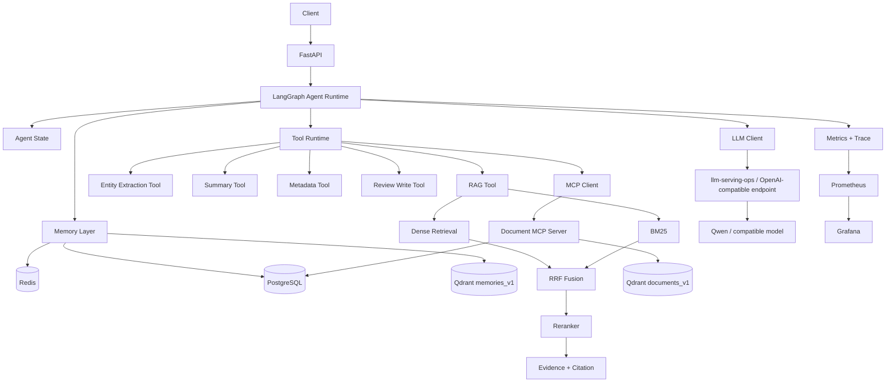
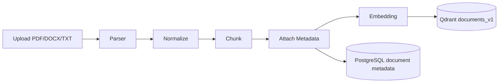
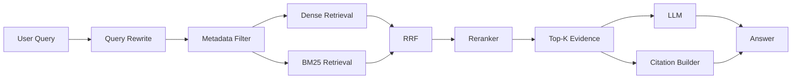
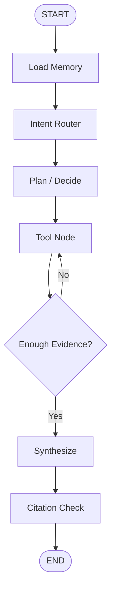
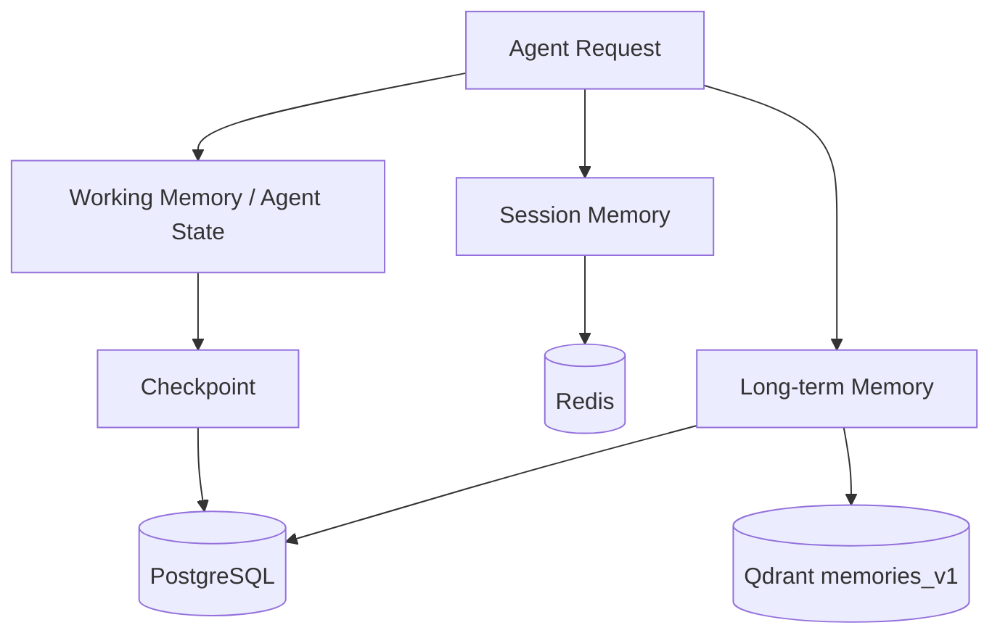
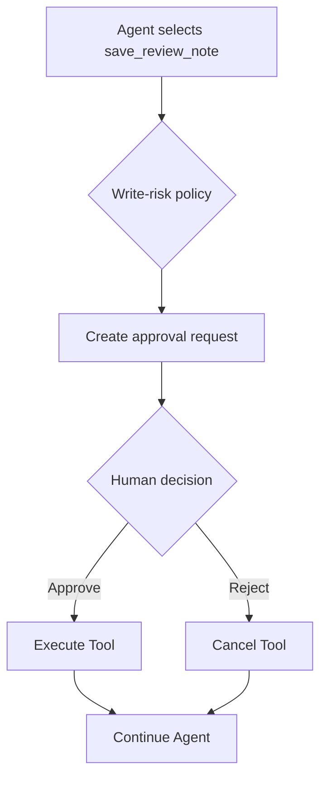
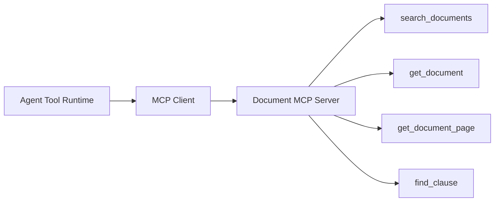

# DocMind-Agent V1.0 Architecture

> Status: **FROZEN**

## 1. Design Principles

1. **Source first** — answers remain traceable to document evidence.
2. **State explicit** — Agent execution state is represented rather than hidden in prompts.
3. **Memory separated** — working, session, long-term and checkpoint memory are distinct.
4. **Tools bounded** — typed inputs, timeouts, retry limits and write-risk policy.
5. **Model decoupled** — generation uses an OpenAI-compatible client.
6. **Observable execution** — every request and graph node can be traced and measured.

## 2. Final Logical Architecture



## 3. Project Boundary

DocMind-Agent owns application intelligence:

```text
document ingestion
RAG
Agent workflow
memory
MCP
evaluation
Agent observability
```

llm-serving-ops owns inference infrastructure:

```text
vLLM
model loading
GPU inference
serving metrics
serving observability
```

Communication is through an OpenAI-compatible HTTP endpoint.

## 4. Document Ingestion Flow



Invariant: every indexed chunk retains enough source metadata to reconstruct a citation.

## 5. RAG Query Flow



Citation metadata is carried from evidence; it is not invented by the generation model.

## 6. Agent Execution Flow



Bounds:

- max Agent steps = 8;
- retryable Tool failure retries = 2;
- protected writes require approval;
- every node emits trace metadata.

## 7. Agent State

Frozen semantic groups:

```text
Identity
├── session_id
└── user_id

Input/context
├── query
└── messages

Decision
├── intent
└── plan

Evidence
├── retrieved_docs
├── tool_results
└── entities

Runtime control
├── current_step
├── retry_count
└── approval_required

Output
└── final_answer
```

The code contract lives in `app/agent/state.py`.

## 8. Memory Architecture



Working Memory: one Agent execution.  
Session Memory: recent messages, summary, TTL.  
Long-term Memory: preferences and reusable confirmed facts.  
Checkpoint: resumable graph execution state.

## 9. Tool Runtime and HITL

V1 tools:

```text
search_documents
extract_entities
summarize_document
query_document_metadata
save_review_note
```

Tool execution:

```text
typed input
→ execute
→ timeout
→ retry if allowed
→ trace
→ result/fallback
```

Protected write path:



## 10. MCP Boundary



M5 proves Server/Client integration, structured tool interfaces and error/timeout handling. It does not build a general MCP platform.

## 11. Data Ownership

PostgreSQL:

```text
documents
sessions
messages
memories
approvals
agent_traces
checkpoints
```

Redis:

```text
recent messages
session cache
summary cache
temporary runtime values
TTL
```

Qdrant:

```text
documents_v1
memories_v1
```

## 12. Observability

Request identity:

```text
request_id
trace_id
session_id
```

Per-node trace:

```text
node
start_time
end_time
status
tool
token_usage
error
```

Serving-level vLLM metrics remain owned by llm-serving-ops.

## 13. M0 Architecture

```mermaid
flowchart LR
    C[Client] --> A[FastAPI :8090]
    A --> P[(PostgreSQL :5432)]
    A --> R[(Redis :6379)]
    A --> Q[(Qdrant :6333)]
    A --> M[/metrics]
```

M0 acceptance:

```text
GET /health
```

must report PostgreSQL, Redis and Qdrant as `up`.

M0 deliberately does not create document schemas, vectors, Agent graphs or memory records.

## 14. Frozen Repository Layout

```text
DocMind-Agent/
├── README.md
├── pyproject.toml
├── .env.example
├── .gitignore
├── compose.yaml
├── Dockerfile
├── app/
│   ├── main.py
│   ├── api/
│   ├── agent/
│   ├── rag/
│   ├── memory/
│   ├── tools/
│   ├── mcp_client/
│   ├── llm/
│   ├── storage/
│   ├── observability/
│   └── core/
├── mcp_server/
│   └── tools/
├── migrations/
├── eval/
│   └── datasets/
├── tests/
│   ├── unit/
│   ├── integration/
│   └── e2e/
├── scripts/
├── docs/
└── data/
    └── samples/
```

Directory ownership remains stable through V1. New top-level modules are not added speculatively.
